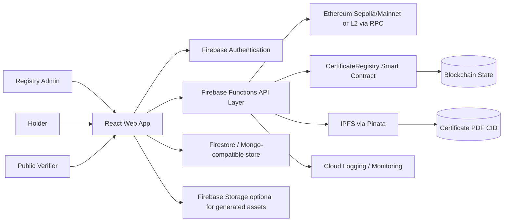

# NAUB Blockchain Certificate System (Firebase Deployment Blueprint)

## 1) Project Overview
This repository contains Chapters 1–3 of a research-driven system design for a **blockchain-based certificate issuance and verification platform** for Nigerian Army University Biu (NAUB). The platform addresses four core institutional failures identified in the study:
- physical certificate forgery,
- insider manipulation risks in centralized records,
- slow and costly manual verification,
- and lack of certificate revocation lifecycle management.

The proposed solution combines:
- Ethereum smart contracts for immutable trust and role enforcement,
- SHA-256 hashing for tamper-evident certificate fingerprints,
- IPFS/Pinata for certificate document storage,
- a web-based DApp interface,
- and NDPR-compliant off-chain personal data handling.

This README translates the research architecture into an implementation-ready execution plan, with **Firebase as the production hosting and application platform**.

---

## 2) Problem Context and Product Vision

### Product Vision
Build a secure, auditable, and NDPR-aligned digital certificate platform where:
- authorized university officials issue certificates,
- students/holders can access and share verifiable credentials,
- and any employer or institution can verify authenticity instantly and freely.

### Core Product Outcomes
- Instant public verification (target: ≤2 seconds perceived response for typical lookups).
- Tamper evidence through deterministic hashing and blockchain anchoring.
- Administrative control through role-based access and revocation workflows.
- Legal/privacy alignment by keeping personally identifiable data off-chain.

---

## 3) System Architecture (Firebase-Centric)

## 3.1 High-Level Architecture



## 3.2 Architectural Pattern
- **Client + BFF/API pattern**:
  - React frontend as client DApp UX.
  - Firebase Cloud Functions as Backend-for-Frontend (BFF) and integration boundary.
- **On-chain / Off-chain split**:
  - On-chain: certificate hash, issuance metadata, revocation status, role governance.
  - Off-chain: personal data, operational metadata, NDPR deletion-capable records.
- **Zero-trust verification path**:
  - Verification outcome must be reproducible from hash + on-chain state.

## 3.3 Core Components

### A) Frontend (React + Firebase Hosting)
- Role-based UI modules:
  - Super Admin Panel,
  - Registry Admin Dashboard,
  - Holder Portal,
  - Public Verification Page.
- Wallet-assisted flows for privileged blockchain actions.
- Input canonicalization + browser-side SHA-256 computation support.

### B) Backend API (Firebase Functions)
- Stateless HTTP/callable functions for:
  - auth session and role checks,
  - certificate issuance orchestration,
  - IPFS upload coordination,
  - chain read/write abstraction,
  - NDPR erasure workflows,
  - audit/event APIs.

### C) Smart Contracts (Solidity)
- `CertificateRegistry`-style contract with:
  - role-based access control,
  - pause/emergency stop,
  - revocation support,
  - secure state transitions and guarded writes.

### D) Data Layer
- Off-chain database (Firestore strongly recommended for native Firebase operations; MongoDB-compatible alternative if mandated by existing research implementation).
- Data partitions:
  - PII collections/tables (strict retention & deletion controls),
  - issuance operational records,
  - verification analytics (aggregated/anonymized where possible).

### E) Decentralized Storage
- IPFS + Pinata for certificate PDF archival.
- CID recorded in operational data and optionally anchored on-chain.

---

## 4) Functional Requirements (Comprehensive)

## 4.1 Identity, Access, and Roles
1. System shall support at least the roles:
   - Super Admin,
   - Registry Admin,
   - Holder,
   - Public Verifier (anonymous).
2. System shall enforce least-privilege permissions for each role.
3. Privileged operations (issue/revoke/pause/unpause/grant-role) shall require authenticated, authorized identity and wallet ownership proof where applicable.

## 4.2 Certificate Issuance
4. Registry Admin shall create a certificate record using structured fields (institutional profile, program, class, graduation metadata, holder linkage).
5. System shall canonicalize fields and generate SHA-256 fingerprint deterministically.
6. System shall generate/store certificate PDF and upload to IPFS.
7. System shall record CID and metadata off-chain.
8. System shall submit on-chain issuance transaction containing required immutable identifiers (hash + references).
9. System shall return a verifiable certificate ID/QR link after finalization.

## 4.3 Verification
10. Public users shall verify by certificate ID, QR, or field reconstruction input.
11. System shall recompute hash and compare with on-chain state.
12. System shall display result states clearly: Valid, Revoked, Not Found, or Mismatch.
13. Verification reads shall not require payment by verifier (read-only blockchain call pattern).

## 4.4 Revocation & Lifecycle
14. Authorized role shall revoke a certificate with reason code and timestamp.
15. Verification response shall always reflect revocation status in real time.
16. Revoked credentials shall remain auditable, not deleted from chain.

## 4.5 Holder Portal
17. Holder shall access their certificate list and verification links.
18. Holder shall view issuance/revocation state and certificate provenance.
19. Holder shall trigger NDPR data actions (e.g., profile data request, erasure request) through governed workflows.

## 4.6 Administration & Governance
20. Super Admin shall manage registry admins and governance parameters.
21. Super Admin shall activate emergency pause/unpause for incident containment.
22. System shall provide immutable-compatible audit trail (on-chain + off-chain correlated logs).

## 4.7 Reporting & Analytics
23. Admin dashboards shall provide issuance counts, verification volume, and status trends.
24. Analytics shall avoid unnecessary PII exposure and favor aggregation.

---

## 5) Non-Functional Requirements (NFRs)

## 5.1 Security
- Smart contract protections: role gates, pausability, reentrancy-safe design, secure modifiers.
- Backend protections: strict authN/authZ, input validation, anti-abuse throttling, signed-request verification.
- Secrets management: Firebase environment config + secret manager for RPC keys, Pinata keys, JWT secrets.
- Security testing: unit, integration, static analysis (e.g., Slither), dependency scanning.

## 5.2 Privacy & NDPR Compliance
- No PII on-chain.
- Data minimization by design.
- Purpose limitation enforcement in schemas and APIs.
- Erasure-capable off-chain PII lifecycle.
- Access logging for accountability.

## 5.3 Performance
- Verification target: user-perceived response ≤2s for common flows.
- API p95 latency targets defined per endpoint class (read vs write).
- Queue/retry strategy for blockchain finality delays.

## 5.4 Availability & Reliability
- Frontend hosted on globally cached Firebase Hosting.
- Cloud Functions with retry/backoff and idempotent handlers.
- Graceful degradation during blockchain RPC latency/spikes.

## 5.5 Scalability
- Horizontal scaling via serverless functions.
- Batched analytics pipelines for high verification volume.
- Storage design for long-term archival growth.

## 5.6 Maintainability
- Modular code boundaries: UI, domain, contract adapter, storage adapter.
- Strong typing and contract/event ABI versioning.
- CI/CD automation and release tagging.

## 5.7 Usability
- Multi-role UX optimized for non-technical administrative users.
- Clear verification status semantics.
- Accessibility baseline (keyboard navigation, contrast, mobile responsiveness).

## 5.8 Auditability
- End-to-end trace IDs across API, storage, and on-chain transactions.
- Downloadable audit evidence packages for compliance reviews.

---

## 6) Firebase Deployment Architecture

## 6.1 Recommended Firebase Services
- **Firebase Hosting**: React SPA hosting + CDN.
- **Firebase Authentication**: admin/operator identity management.
- **Cloud Functions (2nd gen)**: API orchestration, blockchain adapter, IPFS integration.
- **Firestore** (recommended): operational and PII partitioned data model.
- **Cloud Logging / Monitoring**: observability and alerts.
- **Secret Manager**: key management for RPC/Pinata/JWT/private signing material.

## 6.2 Environment Strategy
- `dev` (local emulator + Sepolia)
- `staging` (shared QA + Sepolia)
- `prod` (mainnet or approved L2)

Use separate Firebase projects per environment with isolated secrets and IAM.

## 6.3 CI/CD Pipeline
1. Lint + unit tests.
2. Smart contract tests + static analysis.
3. Build frontend.
4. Deploy functions to staging.
5. Smoke test endpoints and verification flow.
6. Promote to production with controlled release gates.

---

## 7) Detailed Execution Plan

## Phase 0 — Inception & Governance (Week 1)
- Confirm stakeholders and operating model.
- Finalize role matrix and approval workflows.
- Define legal/compliance acceptance criteria (NDPR mapping).
- Produce architecture decision records (ADRs).

**Deliverables**
- Product requirements baseline.
- Security/privacy requirements checklist.
- Deployment and operations RACI.

## Phase 1 — Domain & Data Modeling (Week 2)
- Define canonical certificate schema.
- Define hash input canonicalization rules.
- Create off-chain schema (PII vs non-PII separation).
- Define certificate state machine (Issued, Revoked).

**Deliverables**
- Data dictionary.
- API contract draft (OpenAPI/typed interfaces).
- Hash reproducibility test vectors.

## Phase 2 — Smart Contract Implementation (Weeks 3–4)
- Implement role-controlled certificate registry contract.
- Add pause/unpause and revocation mechanisms.
- Emit domain events for all critical transitions.
- Write comprehensive unit tests.

**Deliverables**
- Solidity contract(s).
- Coverage report.
- Slither analysis report and remediation notes.

## Phase 3 — Firebase Backend Integration (Weeks 5–6)
- Implement Cloud Functions APIs:
  - issue certificate,
  - verify certificate,
  - revoke certificate,
  - role/admin operations,
  - NDPR erasure workflow.
- Integrate IPFS/Pinata upload and CID retrieval.
- Integrate blockchain RPC provider with retries/idempotency.

**Deliverables**
- Deployed staging APIs.
- Integration test suite.
- Failure-mode playbook.

## Phase 4 — Frontend DApp (Weeks 6–8)
- Build role-based screens and guarded routes.
- Implement public verification page with QR flow.
- Implement holder portal and admin dashboards.
- Add transaction status UX (pending/finalized/failed).

**Deliverables**
- Staging UI on Firebase Hosting.
- Usability walkthrough scripts.
- Accessibility checklist results.

## Phase 5 — End-to-End Quality & Security (Weeks 9–10)
- Run E2E scenarios across all core flows.
- Execute performance benchmark suite.
- Run security tests (static + dynamic where possible).
- Conduct incident response drills (pause/unpause, key rotation).

**Deliverables**
- Test evidence pack.
- Security findings and closure status.
- Go-live readiness report.

## Phase 6 — Pilot Rollout (Weeks 11–12)
- Onboard selected registry staff and pilot holders.
- Monitor verification volume, latency, and error budgets.
- Gather feedback and tune UX/operations.

**Deliverables**
- Pilot KPI report.
- Training completion evidence.
- Production hardening backlog.

## Phase 7 — Production Launch & Continuous Improvement (Ongoing)
- Full production cutover.
- SLA/SLO monitoring and alerting.
- Monthly security patching and dependency upgrades.
- Quarterly compliance and audit reviews.

**Deliverables**
- Production runbook.
- KPI dashboards.
- Release cadence plan.

---

## 8) Test and Evaluation Plan

## 8.1 Functional Testing
- Smart contract unit tests for issuance/verification/revocation/roles.
- API integration tests for all endpoints and error branches.
- UI flow tests for each role.

## 8.2 Performance Testing
- Verification throughput and latency under concurrent load.
- Contract write-path latency including blockchain confirmation windows.

## 8.3 Security Testing
- Slither static analysis for Solidity.
- AuthZ penetration checks on admin APIs.
- Input tampering and replay resistance tests.

## 8.4 Usability Evaluation
- SUS-based task evaluations across representative users.
- Focus on admin efficiency and verifier clarity.

## 8.5 Compliance Validation
- NDPR checklist verification:
  - no on-chain PII,
  - erasure-capable off-chain data,
  - consent/purpose records,
  - accountability logs.

---

## 9) Operational Readiness

## 9.1 Observability
- Structured logs with trace IDs.
- Metrics: request latency, error rate, tx success/failure, verification volume.
- Alerts: API failure spikes, RPC failures, unusual revocation bursts.

## 9.2 Incident Response
- Runbooks for:
  - blockchain provider outage,
  - compromised admin account,
  - key leakage suspicion,
  - data privacy incident.

## 9.3 Key Management
- Hardware-backed key custody preferred for production signers.
- Emergency rotation procedures tested before go-live.

---

## 10) Risks and Mitigations
- **Gas volatility / chain congestion** → consider approved L2, batching, and fee policy.
- **Wallet usability for admins** → targeted training + simplified guided flows.
- **Misconfigured role permissions** → policy-as-code checks + approval workflows.
- **Regulatory non-compliance drift** → periodic compliance reviews and automated controls.
- **Third-party dependency risk (RPC/Pinata)** → multi-provider fallback and health checks.

---

## 11) Suggested Repository Structure

```text
/README.md
/contracts
  /CertificateRegistry.sol
/functions
  /src
    /api
    /services
    /adapters
    /auth
    /compliance
/frontend
  /src
    /pages
    /components
    /hooks
    /services
/docs
  /architecture
  /adr
  /runbooks
```

---

## 12) Definition of Done (Production)
A release is production-ready only when all are true:
1. All critical functional requirements pass automated and manual acceptance tests.
2. Smart contracts pass security checks and remediation sign-off.
3. NDPR controls are validated with evidence.
4. Firebase infra, secrets, IAM, and monitoring are configured and peer-reviewed.
5. Rollback and incident runbooks are tested.
6. Stakeholder sign-offs (technical, registry operations, compliance) are complete.

---

## 13) Immediate Next Steps
1. Approve this architecture and requirements baseline.
2. Confirm Firebase project topology (`dev/staging/prod`) and IAM owners.
3. Finalize contract state model and event schema.
4. Start Phase 1 implementation artifacts (schema, API contracts, test vectors).

